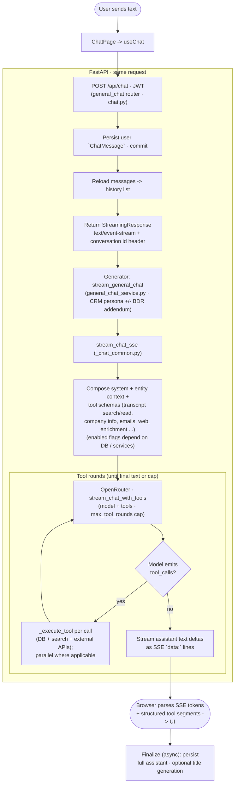

# Oz Demo vs Sauron chat: explained simply (with the ins and outs)

This note compares **two ways to build “smart chat”** in this repo: the **Oz Demo** (`frontend/…`) and **Sauron** (`Sauron/…`). It starts with simple pictures, then goes deeper into **how bytes move**, **where control lives**, and **what breaks**.

For file-by-file routing and prompting tables, see [chat-routing-oz-demo-and-sauron.md](./chat-routing-oz-demo-and-sauron.md).

---

## How to read this doc

1. **Simple story** — Analogies and diagrams if you are new to wiring UI ↔ API ↔ model.
2. **Technical underside** — Same ideas with HTTP, streaming, and responsibility boundaries.
3. **Ins and outs** — Ordering, persistence, failure modes, cost shape, security.
4. **Design choices** — Hard-coding vs abstraction, tools vs branches, when to blend.
5. **ASCII diagrams & defenses** — Box-and-arrow layouts for each system plus **why** those choices are sane (and when to revisit them).

---

## Picture three toys

1. **The screen** — where the human types.
2. **The brain** — a large language model (LLM). It predicts plausible text. It does **not** silently “see” your spreadsheet or CRM unless **your code** puts text from those systems into the prompt (or into tools it can invoke).
3. **Your stuff** — Postgres, JSON files on disk, vector indexes, third-party APIs.

The core design question is: **who decides which stuff to fetch, and in what order—your explicit code, or the model inside a tool loop?**

---

## Oz Demo: “Mom picks the drawer before dinner”

Imagine **you** (the app code) are Mom. The kid (the user) says: “I’m hungry.”

- **You** follow a **checklist**: snack drawer first, then freezer, then cereal.
- When you choose “freezer,” you **only** open the freezer. The kid does not open every drawer alone.

In Oz Demo, **`App.tsx`** is that checklist. When someone sends chat:

1. **`OzAssistantPanel`** calls **`onUserMessage(text, context)`** defined in **`App.tsx`**.
2. A **priority-ordered branch tree** runs: special intents (background agents, charts, competitor flow, lumberyard, …) **short-circuit** when they match.
3. Lead-table handling often tries an **LLM JSON interpreter** first (`interpretLeadTableWithLlm`), then falls back to **rules** (`processLeadTableChat`).
4. On the home **`page === 'oz'`**, if the table path marks **`usedConversationalFallback`**, the app may call **`POST /api/oz/rag-calls`** (pgvector RAG).
5. Otherwise, if OpenAI is configured, **`fetchOpenAIChatCompletion`** hits **`POST /api/oz/openai`** (dev proxy) or the client key path in production builds.

The AI is mostly used as:

- **One-shot helpers** — “Turn this utterance into structured table ops,” “answer given these excerpts,” “polish copy with UI-grounded system text.”
- **Not** as a single endpoint where the model freely invokes **arbitrary server functions in a loop** (that is Sauron’s shape).

**Tiny diagram**

```text
User → OzAssistantPanel → App.tsx (ordered branches)
                              ├→ /api/oz/lumberyard-intel   (example)
                              ├→ /api/oz/rag-calls          (example)
                              └→ /api/oz/openai             (example)
```

### Technical underside (Oz)

- **Router location:** Mostly **client-side** (`App.tsx`). The server pieces are **separate middleware handlers** mounted under **`/api/oz/*`** (see `frontend/vite.config.ts` and `vite.*Api.ts` plugins).
- **Why separate URLs:** Each capability bundles **its own retrieval + prompt + model settings** (lumberyard corpus vs RAG chunks vs generic polish). Your React tree **chooses** which bundle runs.
- **“Implicit tools”:** There are **no** named `search_transcripts` / `web_search` functions exposed to the model in one chat loop. Instead, **you** picked “call lumberyard” vs “call RAG,” which **hard-wires** what data the model sees.

---

## Sauron: “Chef with ingredient buttons on the wall”

Imagine **one counter** labeled **`POST /api/chat`**. The chef (model) can press buttons: **search transcripts**, **read transcript**, **company info**, **emails**, **web**, **Apollo enrichment** (when enabled).

- The chef may press **several** buttons across **multiple rounds**.
- **Your server** runs each button (**tool executor**), returns **notes** into the conversation state, and the chef continues.
- There is a **ceiling** on rounds (`max_tool_rounds` in `stream_chat_with_tools`) so a single chat cannot loop forever.

Flow in code (general chat):

1. **`ChatPage.tsx`** → **`useChat`** → **`POST /api/chat`** with `{ message, conversation_id }`.
2. **`Sauron/backend/app/routers/chat.py`** persists the **user** message, loads **history** from the DB, opens **`StreamingResponse`** (`text/event-stream`).
3. **`stream_general_chat`** (`general_chat_service.py`) sets CRM persona + optional BDR rules, then **`stream_chat_sse`** (`_chat_common.py`).
4. **`stream_chat_sse`** registers **tool schemas**, builds **system + history**, calls **`stream_chat_with_tools`** (`_openrouter.py`), wraps each yielded piece as SSE **`data: …`** lines, ends with **`[DONE]`**.
5. **`useChat`** parses the stream: plain strings accumulate assistant **text**; JSON objects with **`type: tool_call` / `tool_result`** update UI segments (e.g. **`ToolCallGroup`**).

**Tiny diagram**

```text
User → ChatPage → POST /api/chat (JWT) → chat router → stream_general_chat
                                                    → stream_chat_sse
                                                    → OpenRouter + tools (loops)
Browser ← SSE ← same connection (tokens + tool events + [DONE])
```

### Technical underside (Sauron)

- **Router location:** **Server-first.** The React app does **not** implement “if lumberyard then …”; it mostly sends **message + conversation id**.
- **Explicit tools:** JSON schemas describe callable functions; the model emits **`tool_calls`**; your **`_execute_tool`** dispatches by name to DB/search/Apollo/Parallel.
- **Parallel tools:** Multiple tools in one assistant message can run **concurrently** (`asyncio.gather`) before the next model round.

---

## ASCII diagrams

Below are **big-picture** sketches (not every branch or file). Read left-to-right and top-to-bottom.

### Oz Demo — layers (who sits where)

```text
+==================== Browser (React SPA) ====================+
|  OzAssistantPanel                                         |
|    composer / transcript / pills                           |
|          |                                                 |
|          |  onUserMessage(text, context)                    |
|          v                                                 |
|  +-----------------------------------------------------+   |
|  | App.tsx — CENTRAL ROUTER (priority-ordered branches) |   |
|  |  "Which single lane does THIS turn use?"            |   |
|  +-----------------------------------------------------+   |
|          |                                                 |
|          |  fetch() — typically ONE chosen lane per send    |
|          v                                                 |
+==========|==================================================+
           |
           |  HTTP (dev: Vite middleware on same origin)
           v
+==================== /api/oz/* handlers ====================+
|  Each route is a PRE-BAKED PIPELINE:                       |
|    retrieve (optional) -> build prompt -> call model       |
|                                                             |
|  Examples (conceptual):                                     |
|    POST /api/oz/openai          polish / general           |
|    POST /api/oz/rag-calls       embed -> pgvector -> chat  |
|    POST /api/oz/lumberyard-intel corpus + optional web    |
+=====================|======================================+
                      |
                      v
              OpenAI, Postgres, disk JSON, …
```

**Takeaway:** The **browser decides the lane** before the server runs a pipeline. The server does **not** run an open-ended “pick tools until done” loop for Oz chat.

---

### Oz Demo — one turn as a waterfall (first match wins)

```text
                         User presses Send
                                |
                                v
                    +-----------------------+
                    |  Prioritized branches |
                    |  (demos, charts, …)   |
                    +-----------------------+
                                |
              matched? ---------+--------- not matched
                  |                       |
                  v                       v
           Handle UI / API           Lead table path:
           OPEN panels, etc.         LLM JSON interp (optional)
                  |                       |
                  |                       v
                  |               Rules engine (fallback)
                  |                       |
                  |               Still "conversational"?
                  |               (usedConversationalFallback)
                  |                       |
                  |            +----------+-----------+
                  |            | yes (home oz page)  |
                  |            v                     |
                  |     POST /api/oz/rag-calls       |
                  |            |                     |
                  |            +----------+----------+
                  |                       |
                  +-----------+---------+
                              |
                              v
                    Default polish lane:
                    POST /api/oz/openai (if configured)
                              |
                              v
                    Reply string -> OzAssistantPanel
```

**Takeaway:** Lower tiers run **only when** upper tiers did not **consume** the turn. That protects **deterministic demo UX** from being overridden by a generic chat completion.

---

### Oz Demo — same chat widget, many backends (fan-out by route)

```text
                    +------------------+
                    | OzAssistantPanel |
                    |   (one thread UI)|
                    +--------+---------+
                             |
                             v
                      +-------------+
                      |   App.tsx   |
                      +--+----+-----+
           +-------------+ | +-------------+
           |               |               |
           v               v               v
    +-------------+ +-------------+ +-------------+
    | /api/oz/    | | /api/oz/    | | /api/oz/    |
    | lumberyard… | | rag-calls   | | openai      |
    +------+------+ +------+------+ +------+------+
           |               |               |
           +-------+-------+-------+-------+
                   |               |
                   v               v
              Different prompts, temperatures,
              retrieval strategies — chosen BY ROUTE,
              not by model tool selection.
```

---

### Sauron — one HTTP chat pipe + server-owned orchestration

```text
+============= Browser ==============+       +============= FastAPI ==============+
| ChatPage                             |       | POST /api/chat                    |
|   useChat({ endpoint: '/api/chat' })   |       |   JWT auth                        |
|       |                              |       |       |                           |
|       |  POST JSON body               |       |       v                           |
|       +----------------------------->|------>| Persist USER message + load hist |
|       |                              |       |       |                           |
|       |  SINGLE long-lived response |       |       v                           |
|       |<=============================|======| StreamingResponse (SSE)           |
|       |  chunks:                      |       |       |                           |
|       |    data: "Hello"              |       |       v                           |
|       |    data: {"type":"tool_call"} |       | stream_general_chat               |
|       |    data: {"type":"tool_result"}       |       |                           |
|       |    …                          |       |       v                           |
|       |    data: [DONE]               |       | stream_chat_sse                   |
+=======|==============================+       |       |                           |
        ^                                       |       v                           |
        |                                       | stream_chat_with_tools -----------+------+
        |                                       | (tool rounds, bounded)           |      |
        |                                       +================================|======+
        |                                                                        |      |
        |                                        +-------------------------------+      |
        |                                        | OpenRouter (model + tools)           |
        |                                        |   streaming deltas                   |
        |                                        |   tool_calls -> YOUR executors       |
        |                                        +--------------------------------------+
        |
     UI updates as chunks arrive (text + tool indicators).
```

**Takeaway:** The **browser does not pick** “transcript search vs email search” as separate URLs. It opens **one stream**; **the server + model** decide tool usage inside **`stream_chat_sse` / `_openrouter`**.

---

### Sauron — inside one tool loop (conceptual)

```text
   messages[]  +  tool schemas  +  CHAT_MODEL
                    |
                    v
            +---------------+
            | Round 1..N    |    N <= max_tool_rounds (e.g. 5)
            | (streaming)   |
            +-------+-------+
                    |
        +-----------+------------+
        |                        |
        v                        v
  No tool_calls              tool_calls present
        |                        |
        |                        v
        |                 yield tool_call events
        |                        |
        |                        v
        |                 EXECUTE tools on server
        |                 (DB / indexer / web / Apollo)
        |                        |
        |                        v
        |                 append tool results to messages
        |                        |
        |                        +-------> NEXT ROUND
        |
        v
   RETURN (assistant text for this round was already
           streamed to client token-by-token)

   (If ALL rounds were tool-only and loop exhausted:)
        |
        v
   Final stream_chat_completion pass -> closing answer
```

**Takeaway:** **Your code** owns executors and caps; the **model** proposes **which** tools and **when**, subject to prompts and **`tool_choice: auto`**.

---

## Defense of each design (why it is reasonable)

These are **product and engineering defenses**, not claims that either stack is perfect forever.

### Why Oz Demo’s design is defensible

| Choice | Defense |
|--------|---------|
| **Client-side router (`App.tsx`)** | A demo bundles **many workflows** (lead table, lumberyard, RAG, polish). Keeping routing next to **React state** (which panel is open, which page, table view) avoids syncing “what the UI did” with a remote orchestrator. One place sees **both** user text **and** UI truth. |
| **Multiple `/api/oz/*` pipelines instead of one tool loop** | Each demo story can tune **retrieval + prompt + model** independently (RAG vs full corpus vs generic polish). You ship **predictable** behavior: the model never “accidentally” calls an expensive path you did not intend for that turn. |
| **Priority branches / short-circuit** | Demos fail in front of people when chat **talks** instead of **opening the right surface**. Hard ordering ensures **shell behavior** wins over conversational fallback. |
| **`usedConversationalFallback` gating for RAG** | Stops transcript grounding from fighting **table commands**—reduces contradictory assistant behavior when the user still meant a structured action. |
| **Vite middleware for dev** | Fewer processes for a **static + API** prototype; keys stay off the client in dev via proxy. Tradeoff: not the same as a hardened production API boundary without extra work. |
| **Lead table: LLM JSON + rules fallback** | LLM handles messy language; **rules** guarantee something deterministic when the model errors—good split for **UI state machines**. |

**Bottom line:** Oz optimizes for **scripted, multi-surface demos** and **tight coupling between chat and immediate UI state**.

---

### Why Sauron’s design is defensible

| Choice | Defense |
|--------|---------|
| **Single `POST /api/chat` entry** | CRM users ask **open-ended** questions (“What did we last promise Acme?”). A stable contract simplifies **auth**, logging, rate limits, and client code—especially as tools evolve. |
| **Server-side tool loop** | The model can **iterate**: search → read full transcript → fetch emails → synthesize. That mirrors how a human researcher works; fixing every sequence in `if` branches does not scale with question diversity. |
| **SSE streaming** | Multi-tool turns can be **slow**; streaming tokens + visible tool phases preserves **perceived performance** and trust (“it is working”). |
| **JWT + DB-backed history** | Conversations are **first-class product data**: reload, audit, compliance posture. Chat is not ephemeral browser-only state. |
| **Shared `stream_chat_sse` for general + entity chat** | Same **tool fabric** and discipline; only **scope filters** and context blocks change—less duplication than separate bespoke backends per page. |
| **Bounded `max_tool_rounds`** | Without a cap, cost and latency are unbounded; the cap is an explicit **product control** on worst-case behavior. |
| **Structured `tool_call` / `tool_result` events** | Enables **transparent UX** (tool indicators) and future analytics (“which tools correlate with good answers?”). |

**Bottom line:** Sauron optimizes for **evidence-backed, exploratory CRM chat** where **question shape** varies too much to encode purely as client branches.

---

### When each defense stops being enough

- **Oz:** If chat grows until **`App.tsx`** is unmaintainable, or you need **open-ended research** inside one widget without new URLs—extract a **typed router module** or selectively adopt **server-side capabilities** without copying Sauron wholesale.
- **Sauron:** If costs spike or answers **wander**, add **budgets**, **intent shortcuts**, or **stricter routing** for known workflows—the pattern is **hybrid**: gates + tools.

---

## HTTP in plain language: request vs stream

### Regular JSON request

1. Browser sends **one** HTTP request.
2. Server does work.
3. Server returns **one** JSON body (or error).
4. Connection closes.

Good for: “Give me the answer when it’s ready.” Simple to reason about.

### Server-Sent Events (SSE) — what Sauron uses for chat

1. Browser sends **POST** (often with `fetch` + `ReadableStream`).
2. Server holds the connection open and sends **many small chunks**, usually lines like `data: {…}\n\n`.
3. Browser reads chunks **as they arrive** and updates the UI (typing effect, tool indicators).
4. Server sends a sentinel (here, **`data: [DONE]`**) and closes.

**Why it matters:** Users see progress; long multi-tool runs feel alive. **Tradeoff:** harder retries (you already showed half an answer), proxies must not buffer (`X-Accel-Buffering: no` appears in Sauron’s headers for that reason).

### Oz’s responses

Oz paths are **mixed**: some handlers return a **complete** reply string to **`OzAssistantPanel`**; some support **streaming** from the parent depending on how `onUserMessage` is implemented. Conceptually, though, **routing still happens once per turn in `App.tsx`**—you are not inside a server-owned tool loop for general Oz chat.

---

## The tool loop (Sauron): ins and outs

This is the heart of the “agentic” CRM chat.

### One “round” looks like this

Implementation reference: **`stream_chat_with_tools`** in `Sauron/backend/app/services/_openrouter.py`.

1. **Send** `messages` + `tools` to the model API with **`stream: true`**.
2. **While the stream runs**, forward **text deltas** to the client (`yield text`) and **assemble** any **`tool_calls`** fragments from deltas until the stream ends.
3. **If there were no tool calls in this round:** the generator **`return`s immediately**. The user-visible answer is **already** whatever text was streamed in step 2—there is **no extra “finalize” completion** in that path.
4. **If there were tool calls:** append an **assistant** message (with `tool_calls` + any streamed content) to `current_messages`, **`yield` structured `tool_call` events**, **execute** tools ( **`asyncio.gather`** when multiple), append **`role: tool`** results, **`yield` `tool_result` events**, then start **another round**—up to **`max_tool_rounds`**.
5. **If all `max_tool_rounds` iterations ran and every round had tool calls** (so the inner loop never hit the early `return`), control falls through to **`stream_chat_completion`** with the accumulated messages—this is an extra **non-tool** completion pass to produce the **final** assistant wording after the last tool results.

So: **most chats end at step 3** (model answers with streaming text and never invokes tools, or finishes answering after some tool rounds without needing the fall-through). The **fall-through final completion** is specifically for the case where you **used every round as tool rounds** and still need a closing answer.

### What you control vs what the model controls

| Piece | Usually controlled by |
|--------|------------------------|
| **Which tools exist** | Your code (`stream_chat_sse` builds the list; flags disable web/Apollo if keys missing) |
| **Tool implementations** | Your code (`_exec_*` functions): SQL, HTTP clients, transcript indexer |
| **Max rounds** | Your constant (`max_tool_rounds`) |
| **Temperature** | Your defaults (e.g. `0.3` in `stream_chat_sse`) |
| **Whether to call tools at all this turn** | Model (`tool_choice: "auto"`)—you influence heavily via **system prompt** (Sauron pushes “research first”) |

### Ins

- **Composable research** — Same tools serve **general chat** and **entity-scoped chat** (company page passes **`current_scope_filters`** so `search_transcripts` with `scope=current` stays on-entity).
- **UI honesty** — Structured **`tool_call` / `tool_result`** events let users see **what ran** (even if they don’t read raw SQL).

### Outs

- **Nondeterminism** — Same user question may yield different tool sequences across runs (temperature, ranking, model updates).
- **Prompt fragility** — Over-strong “always use 5+ tools” style instructions can waste latency on trivial questions unless you add **intent routing** or budgets.
- **Failure amplification** — One flaky tool (web search timeout) can degrade the whole answer unless **`_safe_execute`** style wrappers return structured errors the model can recover from.

---

## Oz branch ordering: why the sequence matters

Oz is **explicitly ordered** so **deterministic product behavior wins** over **expensive or fuzzy** paths.

Typical intent:

1. **Handle demos and shell UX first** — Things that must **open panels**, flip flags, or drive animations should not lose to a generic LLM reply.
2. **Interpret / rule the lead table** — Structured state updates need **predictable** outputs (JSON interpreter + rules fallback).
3. **Use RAG only when the table did not “consume” the turn** — **`usedConversationalFallback`** avoids fighting the table state machine when the user still meant a grid operation.
4. **Generic polish last** — Broad chat completion runs when nothing else claimed the turn.

**Upside:** Predictable demos and fewer “the model said something but the UI didn’t move” bugs.

**Downside:** If two branches **overlap** semantically (user meant both “filter table” and “question about transcripts”), **whichever runs first wins** unless you invest in **merge logic** or **disambiguation**.

---

## Persistence and memory

### Sauron

- **Conversations and messages** live in the **database** (`ChatConversation`, `ChatMessage`).
- Each **`POST /api/chat`** **writes** the user message before streaming; after the stream, background work **persists** the assistant message and may **generate a title**.
- **Implication:** Refreshing the page can reload history **from the server** (subject to how **`ChatPage`** loads conversations).

### Oz Demo

- The visible **thread** is primarily **React state** inside **`OzAssistantPanel`** (seeded props, then local `transcript`).
- Various backends **do not** automatically store “every Oz chat line” as a first-class product feature in the same way Sauron does; persistence is **workflow-centric** (leads, snapshots in prompts) rather than **chat-first**.
- **Implication:** Treat Oz chat as **session/demo UX** unless you add explicit persistence.

---

## Auth, identity, and secrets

### Sauron

- **JWT** (`get_current_user`) gates **`/api/chat`** and related APIs.
- Tool implementations can enforce **per-user rules** (e.g. company email visibility varies by role/email in `_exec_get_company_emails`).
- **Secrets** (OpenRouter, Apollo, Parallel) stay **server-side** in config/env.

### Oz Demo

- Demo **`/api/oz/*`** routes are oriented around **local/dev convenience**; treat them as **not production-hardened** without adding auth, rate limits, and tenancy checks.
- **`VITE_OPENAI_API_KEY`** in production builds puts key exposure and billing risk **in the browser**—see comments in `ozOpenAi.ts`; prefer proxy patterns for real deployments.

---

## Failure modes (what goes wrong in practice)

### Oz-ish failures

- **Wrong branch taken** — User phrasing hits an early intent matcher; fix by tightening matchers, adding priority, or inserting a **confirm** step for ambiguous verbs.
- **LLM JSON drift** — Table interpreter returns invalid JSON; you rely on **catch + rules fallback** (`interpretLeadTableWithLlm`).
- **Middleware missing** — Static hosting without Vite middleware: **`/api/oz/*`** 404s; `ragCallsClient` and similar guardrails surface errors.

### Sauron-ish failures

- **Stream interrupted** — Network drop mid-SSE: UI may show partial answer; DB finalization may **not** store an assistant message if the handler never completes cleanly—design policy for **partial save** vs **discard**.
- **Tool errors** — Wrapped as JSON errors into the model; quality depends on whether the model **recovers** or **hallucinates** past the error.
- **Round limit hit** — Model still “wanted” more research; user sees an answer that may be **under-evidenced** unless you surface “hit step limit.”

---

## Cost and latency shape (qualitative)

### Oz

- **Cheap path:** Rule handles message → **no** LLM.
- **Medium:** Single completion (polish, lumberyard one-shot).
- **Higher:** RAG (embedding + DB + completion) or stacked calls if multiple branches fire across turns (usually **one** primary backend per user send).

### Sauron

- **Baseline:** At least **one** streaming completion per user message; often **several** because **each tool round** is another model call, plus **tool IO** (DB, web, Apollo).
- **Parallelism helps wall-clock** for multi-tool rounds but **not billable tokens**.
- **Mitigations:** Lower `max_tool_rounds`, stricter prompts for trivial intents, route **FAQ-like** queries to a cheaper flow, cache transcript search results briefly where safe.

---

## Hard-code vs “design better”: when to use which

**Hard-code** (big `if` tree, dedicated endpoints) is **good** when:

- The UX is a **guided demo** or **regulated workflow** (“always show X before Y”).
- Errors are **high stakes** (wrong customer row, wrong financial summary).
- You need **deterministic QA** for a keynote or POC.

**Invest in orchestration** (explicit capability registry, plugin tools, shared chat service) when:

- The same **capability** must appear on **many pages** (home, company, mobile).
- Multiple teams add behaviors—you need **boundaries** instead of one growing file.
- You must enforce **global policies** (budgets, logging, PII redaction, kill switches) in **one** layer.

**Hybrid (often best):**

- **Hard gate** at the edge: auth, tenancy, “dangerous” actions require confirmation.
- **Tools or endpoints** inside: flexible research **after** gates.

---

## Concrete opportunities (ideas, not mandates)

### Oz Demo

- **Extract routing** — Table-driven handlers `(predicate, handler)` with tests per intent; **`App.tsx`** only wires dependencies.
- **Capability catalog** — One markdown or typed enum listing **named behaviors** chat can trigger (reduces “works by accident”).
- **Shared retrieval helpers** — RAG and lumberyard both do “get context → prompt”; shared utilities reduce drift between prompts.
- **User-visible routing (debug)** — Dev-only banner: “Handled by: `rag-calls`” to shorten debugging.

### Sauron

- **Tool budgets** — Per-role caps on rounds, tools, or web calls; soft degrade messages.
- **Golden paths** — Short-circuit known intents with **fixed** plans (“weekly pipeline summary”) before the open-ended loop.
- **Eval harness** — Scripted questions with expected **tool sequences** or **citation patterns** to catch regressions when prompts change.
- **Entity chat docs** — One page explaining **`current_scope_filters`** and transcript indexer behavior for each surface.

---

## Quick comparison table (expanded)

| Concern | Oz Demo | Sauron CRM |
|--------|---------|------------|
| **Primary router** | React **`App.tsx`** | FastAPI **`chat.py`** + **`stream_chat_sse`** |
| **Chat transport** | Mostly ordinary `fetch`; mixed streaming | **SSE** over **`POST /api/chat`** |
| **Capabilities** | **Endpoints** = capability bundles | **Tools** inside one pipeline |
| **Tool loop** | No general loop | Yes (`stream_chat_with_tools`, bounded rounds) |
| **Auth** | Demo-oriented | JWT + role-aware tools |
| **Persistence** | Chat thread mainly **client state** | Messages in **Postgres** |
| **Best for** | Deterministic multi-workflow **demo** | Open-ended **CRM research** chat |

---

## One sentence to remember

- **Oz Demo:** “**We** choose the pipeline first; the model mostly fills in words **inside that lane**.”
- **Sauron:** “**We** expose **labeled actions**; the model chooses how many to use **inside one streamed chat**, within **limits and prompts we set**.”

Both are valid. Production systems often combine them: **explicit routing for safety and UX**, **tool loops for depth** where questions are fuzzy and evidence must be gathered.

---

## Authoritative prompt-processing diagrams

These diagrams are the canonical, implementation-aligned view of how one user prompt is processed in each system.

### Oz Demo — client-side router, one lane per send

```mermaid
flowchart TD
  %% Oz Demo · one authoritative prompt path per send
  A([User sends text]) --> B["OzAssistantPanel -> onUserMessage(text, context)"]
  B --> C{"Eligible for this handler?\n`isLeadTableChatPage`\n(and not Field App command center silent return)"}

  C -->|no| Z([End · no Oz `onUserMessage` reply path])
  C -->|yes| D{T1 · Background-agent flow?\ncollecting OR `matchBackgroundAgentIntent`}

  D -->|handled| Z
  D -->|no| E{T2 · Customer demand / P&L /\nproduct-dashboard intents}

  E -->|handled| Z
  E -->|no| F{T3 · Competitor x product\n(`page === oz` + intent)}

  F -->|handled| Z
  F -->|no| G{T4 · Stock-up · likely-buyers intent}

  G -->|handled| Z
  G -->|no| H{T5 · Lumberyard /\ncall-mining intents}

  H -->|"yes -> POST /api/oz/lumberyard-intel\n(+ GET library if needed)"| Z

  subgraph lead["T6 · Lead distributor table · always runs until return above"]
    direction TB
    I["`interpretLeadTableWithLlm` (optional JSON OpenAI)\n· if handled -> `usedConversationalFallback = false`"]
    J["else `processLeadTableChat` rules engine\n· may set `usedConversationalFallback`"]
    I --> J
  end

  H -->|no| lead

  subgraph ragOpenAI["T7-T8 · Model lanes (after `out` from table path)"]
    direction TB
    K{"`page === oz`\nAND OpenAI configured\nAND `out.usedConversationalFallback`?"}
    K -->|yes| L["POST /api/oz/rag-calls\nembed query -> pgvector -> single-shot chat completion"]
    K -->|no| M
    L --> Z

    subgraph M["Otherwise"]
      direction TB
      N{"OpenAI configured?"}
      N -->|no| O["Reply with deterministic\n`out.reply` only"] --> Z
      N -->|yes| P["Build system + handler snapshot\n+ optional prior exchanges"]
      P --> Q["POST /api/oz/openai · `fetchOpenAIChatCompletion`\n(polish / grounded chat)"]
      Q --> Z
    end
  end

  lead --> K
```

### Sauron CRM — server-led chat with bounded tool loop


