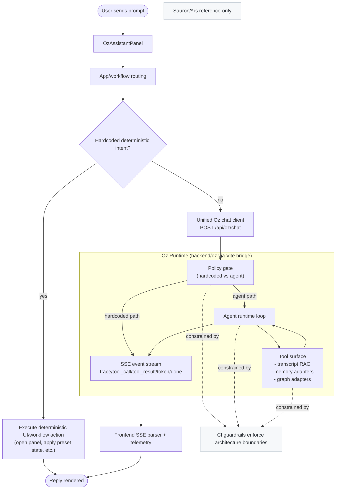

# Oz New Chat Flow Diagram

This diagram reflects the current Oz-target architecture after the refactor waves: deterministic UI handling first, then unified `/api/oz/chat` runtime for non-hardcoded prompts, with tool-backed execution and observable streaming events.

## End-to-end flow

## Deterministic states (what stays hardcoded)

These states are handled before the agent loop and are intended to be predictable UI/workflow outcomes:

- **Workflow-open states**: open specific right-panel experiences (for example customer demand, competitor table, lead context) when explicit intents match.
- **Preset view states**: apply fixed table filters/sorts/presets for known commands.
- **Guided setup states**: bounded setup flows (for example background-agent setup prompts) that have explicit required fields.
- **Known command aliases**: route-level hash/page aliases and explicit deterministic command routing.

Rule of thumb: if behavior is a known, repeatable UI transition with no open-ended reasoning, it remains deterministic.

## Constraints (runtime + architecture)

- **Scope boundary**: `Sauron/*` is reference-only and not modified for Oz runtime work.
- **Ownership boundary**:
  - frontend owns rendering, local UI state, and deterministic transitions,
  - backend/oz owns policy gating, prompt/tool orchestration, retrieval, memory, and graph traversal.
- **Transport boundary**: non-hardcoded turns use one canonical API path (`/api/oz/chat`).
- **Safety boundary**: tool calls are bounded (rounds/limits) and should emit provenance/citation metadata.

## What the SSE parser does

The frontend SSE parser (in the Oz chat client path) reads streamed `data:` frames from `/api/oz/chat` and:

- decodes structured events (`trace`, `tool_call`, `tool_result`, `token`, `done`),
- accumulates token deltas into the assistant reply,
- associates runtime telemetry (trace id, tool timings/results, policy path),
- finalizes on `done` (with a fallback to aggregated tokens if needed).

In short: it turns low-level stream events into user-visible text + debug/telemetry context.

## CI guardrails (what is enforced)

Architecture checks now protect against regressions by failing CI for patterns such as:

- direct model-provider calls from frontend production code,
- bypassing canonical Oz transport (`/api/oz/chat`) with legacy/direct endpoint fanout,
- importing backend runtime modules directly into frontend feature code,
- introducing new architecture drift that violates ownership rules.

These checks are meant to keep the system on the new design path as the codebase evolves.

## Quick reading notes

- Deterministic UX remains first for known hardcoded actions.
- Non-hardcoded turns route through one canonical backend path: `/api/oz/chat`.
- Runtime streams structured events (`trace`, `tool_call`, `tool_result`, `token`, `done`) back to the client.
- Tooling is Oz-scoped (`backend/oz/**`), and `Sauron/**` remains read-only/reference.
