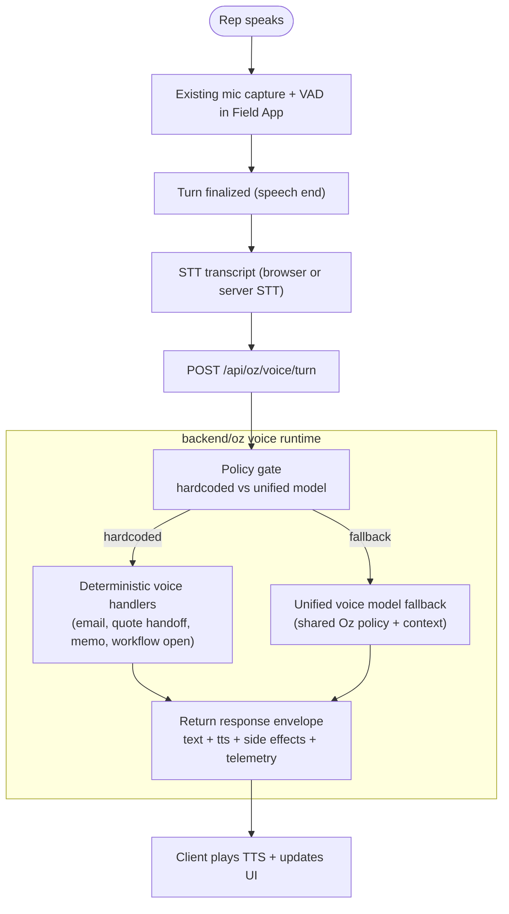

# Oz Voice Routing Architecture (Hardcoded + Unified Model)

This design keeps the current Field App microphone activity detector and turn-taking UX, while replacing scripted-only reply generation with a hybrid router:

1. deterministic hardcoded voice routes for known demo-critical actions, and
2. unified voice-model fallback for everything else.

The goal is chat-like responsiveness with predictable behavior for critical paths.

---

## Goals

- Preserve existing mic + VAD behavior in `FieldAppView` and `useFieldVoiceTurnTaking`.
- Keep deterministic outcomes for high-value commands (email send, quote handoff, memo save, etc.).
- Route non-deterministic turns to one canonical backend voice runtime.
- Support on/off and rollout controls via YAML.
- Keep API keys, model calls, and policy logic server-side.

## Non-goals

- Shipping a fully autonomous tool loop in phase 1 voice.
- Removing all scripted copy immediately (can remain as fallback/demo mode).

---

## Recommended High-Level Architecture




---

## Routing Model

### 1) Deterministic Voice Routes (first priority)

Use a lightweight matcher on normalized transcript text (and optional page/workflow context) for strict commands:

- `send_product_specs_email`
- `queue_background_quote`
- `save_voice_memo`
- `open_customer_history`
- `open_product_recommend`
- `open_upsell_cross_sell`

Each deterministic route returns:

- `replyText` (speakable confirmation),
- optional `sideEffects` (server-validated),
- optional `uiDirectives` (safe, bounded),
- `routeKind: "hardcoded"`.

### 2) Unified Model Fallback (second priority)

If no deterministic match, call the unified voice model path:

- recommended endpoint: `POST /api/oz/voice/turn`
- internally uses shared Oz policy context and optional tools
- returns speakable text + optional directives
- `routeKind: "unified_model"`.

This mirrors the text-chat architecture (`/api/oz/chat`) but is voice-oriented.

---

## YAML Toggle and Rollout Controls

Use one YAML config as the control plane, loaded by server at startup (or hot-reloaded if desired).

Example `config/voice-routing.yaml`:

```yaml
voice:
  enabled: true
  preserve_client_vad: true

  routing:
    deterministic_first: true
    fallback_mode: unified_model   # unified_model | scripted_only | off
    allow_scripted_queue_fallback: true

  providers:
    stt:
      mode: browser_primary         # browser_primary | server_primary | server_only
      server_provider: openai_whisper
    unified_model:
      provider: openai_realtime     # openai_realtime | openai_responses
      model: gpt-realtime
      timeout_ms: 3500
    tts:
      provider: elevenlabs
      timeout_ms: 50000

  deterministic_routes:
    send_product_specs_email: true
    queue_background_quote: true
    save_voice_memo: true
    open_customer_history: true
    open_product_recommend: true
    open_upsell_cross_sell: true

  safety:
    max_turn_latency_ms: 4500
    redact_pii_logs: true
    reject_empty_transcript: true

  observability:
    emit_trace_events: true
    include_route_decision: true
```

### Toggle semantics

- `voice.enabled=false`: current behavior remains untouched.
- `fallback_mode=scripted_only`: deterministic + existing scripted queue only.
- `fallback_mode=unified_model`: deterministic first, then model fallback (recommended target).
- Per-route booleans allow incremental rollout with low risk.

---

## API Contracts (recommended)

### `POST /api/oz/voice/turn`

Request:

- `transcript`
- `trace_id`
- `session_id`
- `page/workflow context`
- optional recent turn history

Response:

- `routeKind`: `hardcoded | unified_model | scripted_fallback`
- `replyText`
- `sideEffects[]`
- `uiDirectives[]`
- `telemetry` (latency, provider, model, route decision)

### Optional: `POST /api/oz/voice/stt`

Needed only when `server_primary` or `server_only` STT mode is enabled.

---

## What Stays Client-Side vs Server-Side

### Client-side (keep in frontend)

- Mic permission, device selection, stream lifecycle.
- VAD / speech-end detection (`useFieldVoiceTurnTaking`).
- Orb states and playback UI.
- TTS playback controls (`play/stop/mute`).
- Barge-in behavior (interrupting playback when user starts speaking).

### Server-side (move/keep in backend)

- Route policy gate (deterministic vs unified model).
- Deterministic command validation and side-effect authorization.
- Unified model invocation and prompts/policy.
- Secrets and provider keys (STT/model/TTS as needed).
- Centralized telemetry, tracing, and guardrails.

Why: this split keeps latency-sensitive interaction local while protecting security, consistency, and release control.

---

## Why This Design Is Optimal For This Repo

1. **Matches your current architecture direction**
  Text already moved to a canonical unified backend path. Voice should follow the same principle for maintainability.
2. **Preserves deterministic demo reliability**
  Known mission-critical actions stay hardcoded and predictable.
3. **Improves latency without sacrificing control**
  Client VAD remains instant; server routing only starts after speech-end, minimizing unnecessary round trips.
4. **Safe incremental rollout**
  YAML toggles allow controlled migration by environment, route, and provider mode.
5. **Cleaner operational model**
  Routing decisions, side effects, and model behavior are centralized, observable, and debuggable.
6. **Future-proof for realtime voice**
  The same policy gate can later front a websocket/realtime path without rewriting client UX primitives.

---

## Phased Migration Plan

### Phase 0: Baseline (current)

- Keep scripted queue as primary.
- Add server config file and read path only.

### Phase 1: Hybrid turn router

- Introduce `POST /api/oz/voice/turn`.
- Enable deterministic routes + scripted fallback.
- Keep existing TTS endpoint.

### Phase 2: Unified fallback on

- Switch `fallback_mode: unified_model`.
- Keep deterministic routes enabled.
- Keep scripted queue as emergency fallback.

### Phase 3: Realtime optional

- Add realtime provider path behind YAML.
- Maintain deterministic gate and side-effect policy unchanged.

---

## Risks and Mitigations

- **STT quality variance**: keep browser/server mode toggle and confidence thresholds.
- **Model latency spikes**: set hard timeout + fallback to scripted acknowledgement.
- **Over-triggered deterministic routes**: require high-confidence phrase patterns + context checks.
- **Side-effect safety**: execute side effects only server-side with explicit allowlist.

---

## Decision Summary

Adopt a **deterministic-first + unified-model fallback** voice router behind a YAML control plane. Keep mic/VAD/orb on client, move routing/policy/side effects/model orchestration to server. This gives the fastest path to chat-like voice responsiveness while preserving demo-critical hardcoded behavior and operational safety.